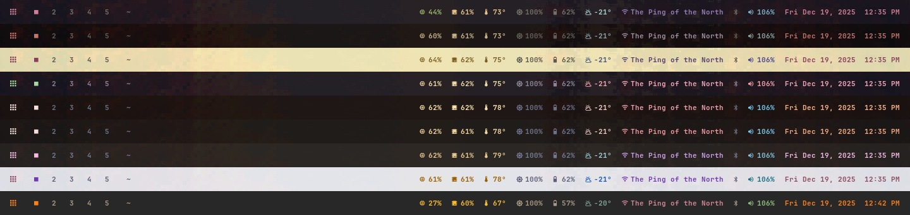

# SumiNami Bar

A polished, feature-rich Waybar theme with rich tooltips, resolution-aware scaling, and multiple color schemes.


## Features

- **Rich Pango Tooltips** - Detailed, styled tooltips with color-coded information
- **Resolution-Aware Scaling** - Automatically adjusts font sizes and dimensions for different displays
- **Multiple Color Schemes** - 9 themes: Kanagawa (4 variants), Catppuccin (4 variants), Gruvbox Dark
- **Comprehensive Modules** - CPU, Memory, Temperature, Battery, Network, Traffic, Bluetooth, Audio, Weather, Media
- **Custom Pickers** - Themed wofi menus for WiFi and Bluetooth management
- **Hardware Detection** - Gracefully hides modules when hardware isn't present (no battery on desktop, etc.)
- **Smart Workspaces** - Visual distinction between empty and occupied workspaces
- **Cross-Hardware Support** - Works with Intel and AMD CPUs, various power managers (TLP, auto-cpufreq, power-profiles-daemon)
- **Central Configuration** - Single config file for all customizations

## Screenshots



*From top to bottom: Kanagawa, Kanagawa Dragon, Kanagawa Lotus, Kanagawa Blossom, Catppuccin Mocha, Catppuccin Macchiato, Catppuccin Frappe, Catppuccin Latte, Gruvbox Dark*

## Installation

### Quick Install (Recommended)

Run the interactive installer:

```bash
bash <(curl -s https://raw.githubusercontent.com/lootmancerstudios/suminami-bar/main/install.sh)
```

The installer will:
- Check and install missing dependencies
- Automatically backup your existing waybar config
- Clone and configure SumiNami Bar
- Start waybar

### Manual Install

If you prefer manual installation:

```bash
# Install dependencies (Arch Linux)
sudo pacman -S waybar wofi brightnessctl playerctl lm_sensors ttf-jetbrains-mono-nerd

# Backup existing config
mv ~/.config/waybar ~/.config/waybar.bak

# Clone SumiNami Bar
git clone https://github.com/lootmancerstudios/suminami-bar.git ~/.config/waybar

# Make scripts executable
chmod +x ~/.config/waybar/scripts/*

# Generate styles and start
~/.config/waybar/scripts/generate-style && waybar
```

### Hyprland Setup

Add to your Hyprland config (`~/.config/hypr/hyprland.conf`):

```ini
exec-once = ~/.config/waybar/scripts/generate-style && waybar
```

### Uninstall / Restore Previous Config

Run the installer again and select "Restore previous config" or "Uninstall":

```bash
~/.config/waybar/install.sh
```

Your previous waybar config is saved in `~/.config/waybar-backups/`.

## Configuration

Edit `~/.config/waybar/suminami.conf`:

```ini
# Color Scheme
# Available: kanagawa, kanagawa-dragon, kanagawa-lotus, kanagawa-blossom
#            catppuccin-mocha, catppuccin-macchiato, catppuccin-frappe, catppuccin-latte
#            gruvbox-dark
color_scheme=kanagawa

# Modules (true/false)
module_taskbar=false
module_media=true
module_weather=true
module_bluetooth=true
module_backlight=true
module_traffic=false     # Live upload/download speeds

# Thresholds
cpu_warning=50
cpu_critical=80
memory_warning=60
memory_critical=85
temp_warning=70
temp_critical=85
battery_warning=30
battery_critical=15

# Behavior
tooltip_delay=200        # Milliseconds

# Weather location (leave empty for auto-detect via IP)
# Formats: City | City,Country | City,State | Airport code | Coordinates
weather_location=
# Examples: London, Paris,France, Austin,TX, JFK, 48.8567,2.3508

# Custom commands (leave empty for defaults)
launcher_command=wofi --show drun
wifi_click_command=              # Default: built-in wifi-picker
bluetooth_click_command=         # Default: built-in bluetooth-picker
```

After editing, restart waybar:
```bash
pkill waybar && ~/.config/waybar/scripts/generate-style && waybar
```

## Color Schemes

### Kanagawa Family
Inspired by [Kanagawa.nvim](https://github.com/rebelot/kanagawa.nvim) and The Great Wave off Kanagawa painting.

| Scheme | Description |
|--------|-------------|
| `kanagawa` | Wave (default) - Original dark theme with cool blues |
| `kanagawa-dragon` | Darker variant with warmer, muted earth tones |
| `kanagawa-lotus` | Light variant with soft, warm cream tones |
| `kanagawa-blossom` | Dark theme with cherry blossom pink pastels |

### Catppuccin Family
Inspired by [Catppuccin](https://github.com/catppuccin/catppuccin) - soothing pastel theme.

| Scheme | Description |
|--------|-------------|
| `catppuccin-mocha` | Darkest variant with rich, vibrant pastels |
| `catppuccin-macchiato` | Dark with slightly warmer undertones |
| `catppuccin-frappe` | Medium dark with cool undertones |
| `catppuccin-latte` | Light variant with warm, soft tones |

### Gruvbox
Inspired by [Gruvbox](https://github.com/morhetz/gruvbox) - retro groove color scheme.

| Scheme | Description |
|--------|-------------|
| `gruvbox-dark` | Warm, earthy tones with orange accents |

### Adding Custom Schemes

Create a new CSS file in `~/.config/waybar/colors/`. Copy an existing theme as a starting point:

```bash
cp ~/.config/waybar/colors/kanagawa.css ~/.config/waybar/colors/my-theme.css
```

Key variables to customize:

```css
/* Background shades (darkest to lightest) */
@define-color sumiInk0 #16161D;  /* Bar background */
@define-color sumiInk3 #1F1F28;  /* Hover backgrounds */
@define-color sumiInk5 #363646;  /* Borders */

/* Foreground */
@define-color fujiWhite #DCD7BA;  /* Main text */
@define-color fujiGray #727169;   /* Dimmed text */

/* Module colors (what you see in the bar) */
@define-color module-clock #D27E99;
@define-color module-launcher #D27E99;
@define-color module-workspace-active #D27E99;
@define-color module-system #98BB6C;      /* CPU, memory, temp */
@define-color module-weather #A3D4D5;
@define-color module-network #957FB8;
@define-color module-audio #7FB4CA;
@define-color module-muted #727169;       /* Inactive elements */
@define-color state-warning #E6C384;
@define-color state-critical #E46876;
```

Then set `color_scheme=my-theme` in suminami.conf.

## Modules

| Module | Description | Click Action |
|--------|-------------|--------------|
| Launcher | App launcher icon | Opens wofi (configurable) |
| Workspaces | Hyprland/Sway workspaces (occupied vs empty) | Switch workspace |
| Media | Now playing info | Play/pause |
| Window | Active window title | - |
| CPU | Usage with top processes | Opens btop/htop |
| Memory | Usage with top processes | - |
| Temperature | CPU temp (Intel/AMD), GPU, fan speed, power mode | - |
| Backlight | Display & keyboard brightness | Scroll to adjust |
| Battery | Charge, time remaining (multi-battery support) | - |
| Power Profile | Current power mode (power-profiles-daemon only) | Cycle profiles |
| Weather | Current conditions (auto or manual location) | - |
| Network | WiFi/Ethernet status, signal strength | WiFi picker |
| Traffic | Live upload/download speeds (optional) | - |
| Bluetooth | Connection status, device battery | Bluetooth picker |
| Audio | Volume, mic status | Toggle mute |
| Clock | Date and time | Calendar tooltip |

**Note:** Power Profile module only appears with `power-profiles-daemon`. If using TLP or auto-cpufreq, power mode is shown in the Temperature tooltip instead.

## Customization

### Toggling Modules

Enable or disable modules in `suminami.conf`:

```ini
module_taskbar=false
module_media=true
module_weather=true
module_bluetooth=true
module_backlight=true
module_traffic=false
```

After changing, restart waybar:
```bash
pkill waybar && ~/.config/waybar/scripts/generate-style && waybar
```

### Tooltip Styling

Tooltips use Pango markup. Edit the scripts in `~/.config/waybar/scripts/` to customize.

## Troubleshooting

### Waybar not starting
```bash
# Check for errors
waybar -l debug
```

### Icons not showing
Ensure JetBrainsMono Nerd Font is installed and set in style.css.

### Modules not appearing
- Check if required tools are installed (sensors, brightnessctl, etc.)
- Verify hardware exists (battery, bluetooth controller, etc.)
- Check script permissions: `chmod +x ~/.config/waybar/scripts/*`

### WiFi/Bluetooth picker not themed
Run `generate-style` to regenerate wofi theme:
```bash
~/.config/waybar/scripts/generate-style
```

## Credits

- **Color Schemes:**
  - [Kanagawa](https://github.com/rebelot/kanagawa.nvim) by rebelot
  - [Catppuccin](https://github.com/catppuccin/catppuccin) by Catppuccin Org
  - [Gruvbox](https://github.com/morhetz/gruvbox) by morhetz
- **Inspiration:** The Great Wave off Kanagawa by Katsushika Hokusai

## License

MIT License - See [LICENSE](LICENSE) for details.

Color schemes are from their respective projects and maintain their original licenses.
